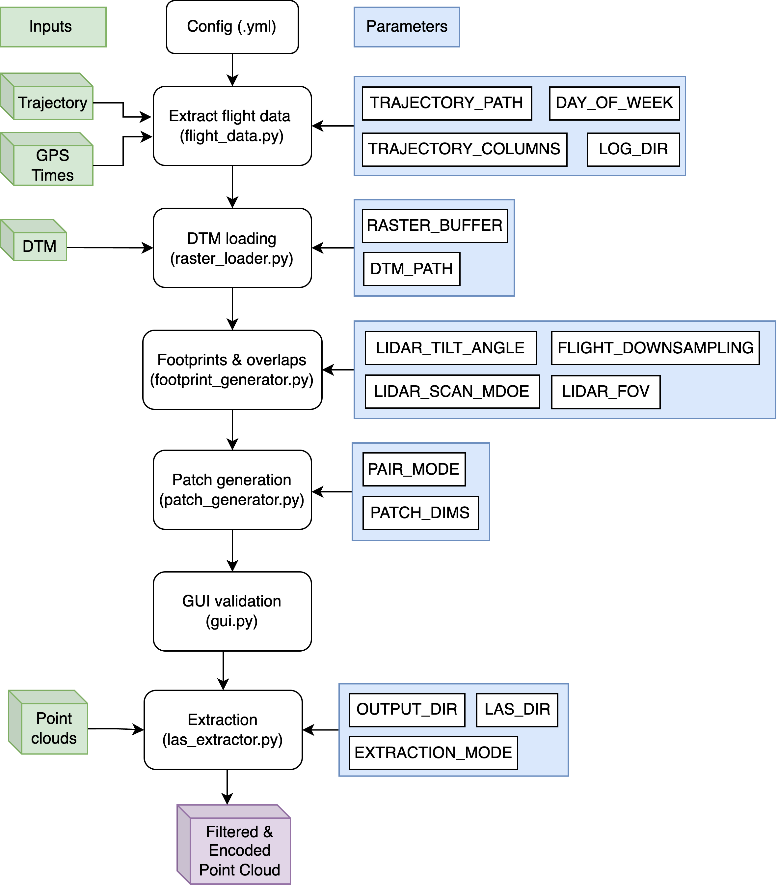
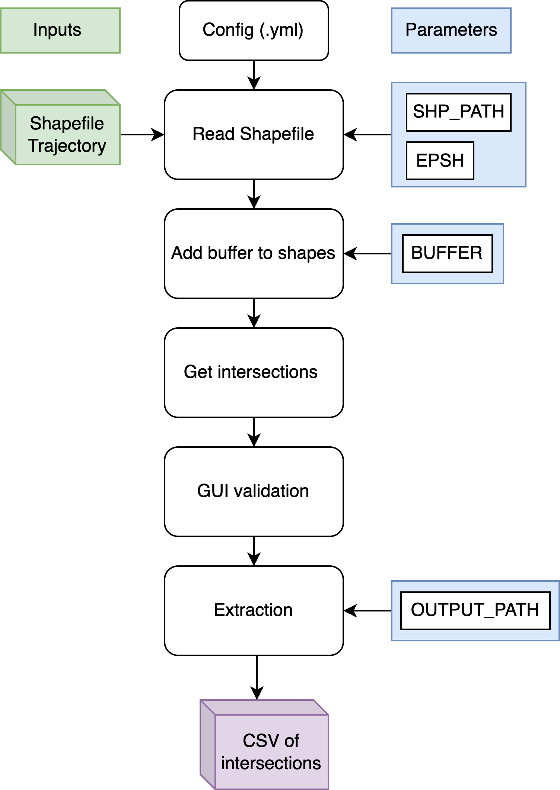

# ESO semester project

## Overview

This repository presents a modular and efficient pipeline for detecting spatial overlaps in LiDAR datasets, 
covering both Airborne Laser Scanning (ALS) and Mobile Laser Scanning (MLS) acquisitions. The project was 
developed as part of a semester project at EPFL within the Environmental Sensing and Observation (ESO) Laboratory.

The purpose of this tool is to identify and extract meaningful regions where LiDAR acquisitions overlap, 
to facilitate and optimize downstream tasks such as point-to-point matching. 

---

## Project Overview

The pipeline is composed of two main branches:

- **ALS Pipeline**: Computes the theoretical footprint of aerial LiDAR scans based on flight trajectory, sensor configuration, and digital terrain models (DTM). It then generates rectangular patches in overlap zones and extracts points accordingly.

- **MLS Pipeline**: Detects overlaps by buffering road segments (from shapefiles), computing their geometric intersections, and enabling manual selection/export through a GUI.

Both workflows are controlled via YAML configuration files and support interactive graphical interfaces for inspection and export.

---

## Project Structure & Workflow

This project is organized into two main processing pipelines:

---

### Airborne Laser Scanning (ALS)

The ALS pipeline extracts and encodes overlap zones based on flight trajectories and terrain modeling.
It proceeds through a set of modular steps controlled via a configuration file:
```text
ESO_semester_project/
├── ALS/
│   ├── main.py                # Main entry point for ALS processing
│   ├── config/                # YAML configuration files (e.g., Arpette_config.yml)
│   └── utils/                 # Submodules for trajectory, DTM loading, footprint, patch, extraction
```

<div align="center">
  
</div>
---

### Mobile Laser Scanning (MLS)

The MLS pipeline relies on geometric buffering and shapefile line overlaps to identify scan redundancies in road-based acquisitions.

```text
ESO_semester_project/
├── MLS/
│ ├── main_MLS.py # Main entry point for MLS pipeline
│ ├── run_mls.sh # Launcher shell script
│ ├── Config/ # Configuration file (e.g., mls_config.yml)
│ └── utils/ # GUI and intersection logic
```

<div align="center">
  
</div>


---

